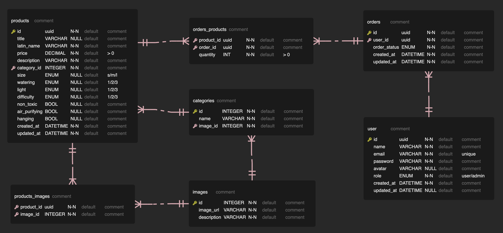

# Fullstack Project

This is the final project of Integrify Academy which involves creating a Fullstack project with React and Redux in the frontend and ASP.NET Core 7 in the backend. The result is an indoor plant e-commerce site called Evergreen which features basic user functionalities (registering, authentication, browsing through products, shopping cart, ordering) as well as admin functionalities for managing users, products and orders.

## Table of Contents

1. [Technologies](#technologies)
2. [Functionalities](#functionalities)
3. [Frontend](#frontend)
4. [Backend](#backend)
5. [Deployment](#deployment)
6. [Running the project](#running-the-project)

## Technologies

- Frontend: SASS, TypeScript, React, Redux Toolkit
- Backend: ASP.NET Core, Entity Framework Core, PostgreSQL

## Functionalities

### User

1. User Management: a user is able to...
   - register for an user account (not admin account)
   - log in and out
   - _extra_: edit certain properties of their account
   - _extra_: unregister
   - _extra_: Google OAuth
2. Products: a user is able to...
   - view all available products
   - view a single product
   - search and sort products
3. Cart: a user is able to...
   - add products to a shopping cart
   - manage their shopping cart
   - checkout the shopping cart / place an order
4. _extra_: Order Management: a user is able to...
   - view their order history
   - track the status of their order
   - cancel their order (within a timeframe)

### Admin

1. User Management: an admin is able to...
   - view users
   - delete users
   - _extra_: edit user roles
   - _extra_: create new users and admins
2. Product Management: an admin is able to...
   - view products in admin mode
   - add products
   - edit products
   - delete products
3. Order Management: an admin is able to...
   - view all orders
   - _extra_: view order details
   - _extra_: update order status
   - _extra_: cancel orders

## Frontend

The frontend mostly reuses the previous [frontend project](https://github.com/miraemilia/fs16_6-frontend-project/).

The frontend code and documentation are found in [this repository]().

## Backend

### Requirements

- CLEAN architecture
- complies with Rest API
- unit testing (xunit)
   - service layer (other layers recommended)
   - implemented early and regularly
   - good coverage for main functionalities
- _optional_: integration testing
- error handling
- documentation (README.md and Swagger)
- frontend, backend and database on live servers

### Database

### Design and layers

- WebAPI
- Controller
- Service
- Core

## Deployment

[Link to deployment]()

## Running the project

### Requirements
- [.NET](https://dotnet.microsoft.com/en-us/download)

### Instructions
- clone the project
- run the project with `dotnet watch --project Evergreen.WebAPI`
- run tests with `dotnet test`
