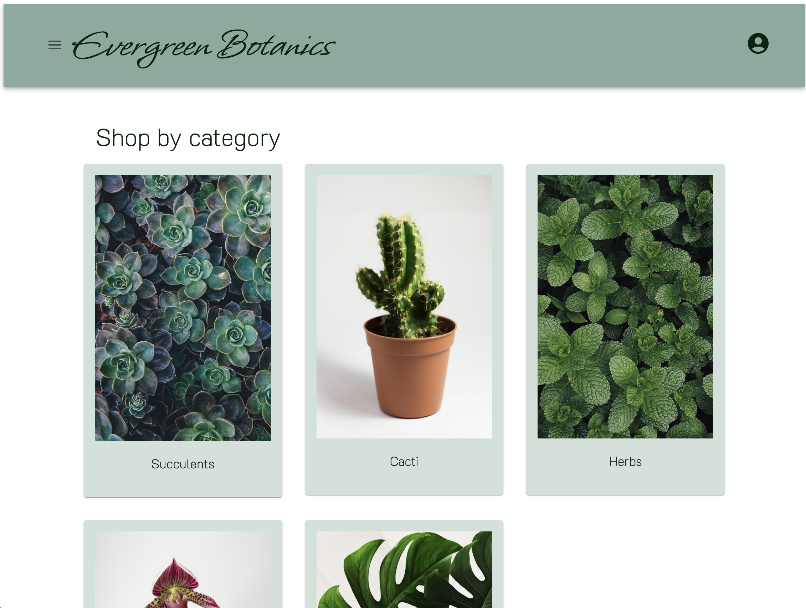
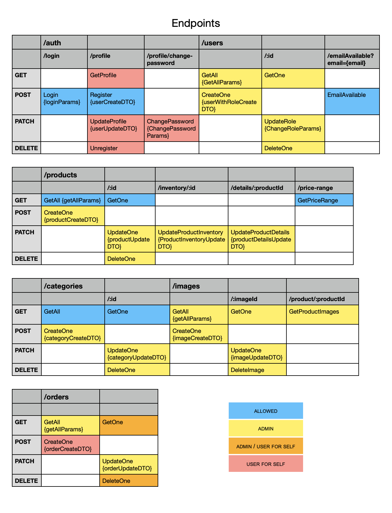

# Fullstack Project


This is the final project of Integrify Academy which involves creating a Fullstack project with React and Redux in the frontend and ASP.NET Core 7 in the backend. The result is an indoor plant e-commerce site called Evergreen which features basic user functionalities (registering, authentication, browsing through products, shopping cart, ordering) as well as admin functionalities for managing users, products and orders.

- [Link to deployed project](https://evergreenbotanics.netlify.app/)
- [Walk-through of main functionalities](https://github.com/miraemilia/evergreen?tab=readme-ov-file#walk-through)


## Table of Contents

1. [Technologies](#technologies)
2. [Functionalities](#functionalities)
3. [Frontend](#frontend)
4. [Backend](#backend)
   - [Design](#design)
   - [Deployment](#deployment)
   - [Running the project](#running-the-project)

## Technologies

- Frontend: SASS, TypeScript, React, Redux Toolkit
- Backend: ASP.NET Core, Entity Framework Core, PostgreSQL

## Functionalities

### User

1. User Management: a user is able to...
   - register for a user account (not admin account)
   - log in and out
   - edit their name, email and avatar
   - (backend only: change their password)
   - (backend only: unregister)
2. Products: a user is able to...
   - view all available products
   - view a single product
   - search and sort products
3. Cart: a user is able to...
   - add products to a shopping cart
   - manage their shopping cart
   - checkout the shopping cart / place an order
4. Order Management: a user is able to...
   - view their order history
   - (backend only: cancel their order while it is processing)

### Admin

1. User Management: an admin is able to...
   - view users
   - delete users
   - edit user roles
   - (backend only: create new users and admins)
2. Product Management: an admin is able to...
   - view products in admin mode
   - add products
   - edit products
   - delete products
3. Order Management: an admin is able to...
   - view all orders
   - update order status
   - (backend only: view order details)
   - (backend only: delete an order while it is processing)

## Frontend

The frontend code and documentation are found in [this repository](https://github.com/miraemilia/evergreen).



## Backend

### General

- CLEAN architecture
- complies with Rest API
- EF core managed database
- error handling middleware
- authentication and authorization
- unit testing for service layer (xunit)
- documentation (README.md and Swagger)
- backend and database deployed on live servers

### Design

#### Database design


#### Architecture


##### Repositories
   - CategoryRepository
   - ImageRepository (inherits from BaseRepository)
   - OrderRepository
   - ProductDetailsRepository (inherits from BaseRepository)
   - ProductRepository
   - UserRepository

##### Services
   - AuthService
   - CategoryService
   - ImageService (inherits from BaseService)
   - OrderService
   - ProductDetailsService (inherits from BaseService)
   - ProductService
   - UserService

##### Controllers
   - AuthController
   - CategoryController
   - ImageController
   - OrderController
   - ProductController
   - UserController

##### Middleware
   - authentication: token-based
   - authorization: role-based policy, id check from token
   - error handling

##### Database
   - code-first
   - seeded with csv data

#### Endpoints



### Deployment

[Link to backend deployment](https://evergreenbotanics.azurewebsites.net/)

### Running the backend locally

#### Requirements
- [.NET](https://dotnet.microsoft.com/en-us/download)
   - [Entity Framework tool](https://learn.microsoft.com/en-us/ef/core/cli/dotnet)
- Postgres database (provide connection string in appsettings.json)

#### Instructions
- clone the project
- create a file named appsettings.json in the Evergreen.WebAPI folder with the following content (change ***)
```
{
  "Logging": {
    "LogLevel": {
      "Default": "Information",
      "Microsoft.AspNetCore": "Warning"
    }
  },
  "AllowedHosts": "*",
  "ConnectionStrings": {
    "LiveDb": "Host=***;Database=***;Username=***;Password=***;",
  },
  "Jwt": {
    "Issuer": ***,
    "Audience": ***,
    "Key": ***
  }
}
```
- create seed data 
- initialize database at Evergreen.Webapi with `dotnet ef migrations add {MigrationName}` and `dotnet ef database update`
- run the project with `dotnet watch --project Evergreen.WebAPI`
- run tests with `dotnet test`
